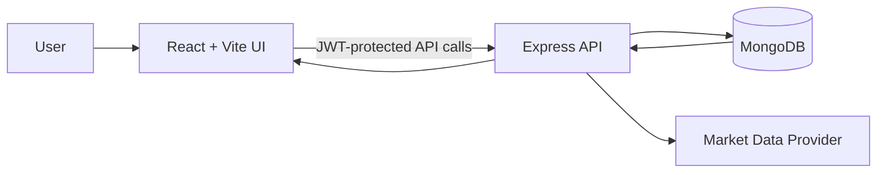
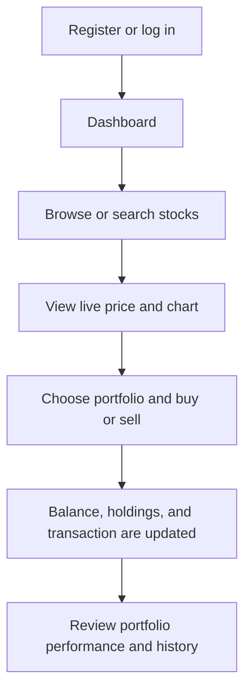

<div align="center">

# SB Stocks

### A full-stack paper-trading platform for practising the market without financial risk.

[](https://react.dev/)
[](https://nodejs.org/)
[](https://expressjs.com/)
[](https://www.mongodb.com/)
[](https://vite.dev/)

**Explore live US stock data · Build virtual portfolios · Trade with $100,000 in virtual funds**

</div>

---

## Overview

SB Stocks is a responsive MERN application designed for beginner investors and students. It provides a realistic, risk-free environment where users can research stocks, create portfolios, place virtual buy and sell orders, monitor profit and loss, and learn from their trading history.

> **Note:** This project supports paper trading only. No real orders are placed and no real money is used.

## Highlights

| Feature | Description |
| --- | --- |
| 🔐 Secure authentication | JWT sessions with passwords encrypted using bcrypt. |
| 💰 Virtual funds | Every new account starts with **$100,000** in practice capital. |
| 📈 Market exploration | Search US-listed stocks and view live prices, daily movement, and price history. |
| 🔁 Paper trading | Buy and sell virtual shares with balance and holding validation. |
| 🗂️ Portfolios | Create multiple portfolios and review holdings, average price, and unrealized P/L. |
| ⭐ Watchlist | Keep important stock symbols in a personal watchlist. |
| 🧾 Activity history | Review completed buy and sell transactions with timestamps. |
| 🛡️ Admin controls | Role-protected management of the internal stock catalog. |
| 📱 Responsive design | A polished React interface that adapts to desktop and mobile screens. |

## Technology Stack

| Layer | Technologies |
| --- | --- |
| Frontend | React, Vite, Redux Toolkit, Axios, Chart.js, React Toastify |
| Backend | Node.js, Express, JWT, bcryptjs, Morgan |
| Database | MongoDB with Mongoose |
| Market data | Yahoo Finance search and chart endpoints, requested by the Express API |
| Development | Git, GitHub, npm, MongoDB Community Server |

## System Architecture



## User Flow



## Core Data Model

```text
User
 ├── name, email, password, contact, role
 └── virtualBalance

Portfolio
 ├── user
 ├── name
 └── holdings [symbol, name, quantity, averagePrice]

Transaction
 ├── user, portfolio, symbol, name
 ├── type (BUY | SELL)
 ├── quantity, price
 └── createdAt

Watchlist
 ├── user
 └── symbols[]
```

## Local Installation

### Prerequisites

- Node.js 18 or later
- npm 8 or later
- MongoDB Community Server or a MongoDB Atlas cluster
- Git

### 1. Clone the repository

```bash
git clone https://github.com/prashanthkesavarapu/SB-Stocks.git
cd SB-Stocks
```

### 2. Install dependencies

```bash
npm install
npm install --prefix server
npm install --prefix client
```

### 3. Configure environment variables

Copy the example file:

```bash
copy server\.env.example server\.env
```

Update `server/.env`:

```env
PORT=5000
MONGODB_URI=mongodb://127.0.0.1:27017/sb_stocks
JWT_SECRET=replace-with-a-long-random-secret
CLIENT_URL=http://localhost:5173
ADMIN_EMAIL=admin@example.com
```

> Register using the configured `ADMIN_EMAIL` to receive the administrator role.

### 4. Start the application

```bash
npm run dev
```

Open [http://localhost:5173](http://localhost:5173) in your browser.

## Available Commands

| Command | Purpose |
| --- | --- |
| `npm run dev` | Runs the React frontend and Express backend together. |
| `npm run client` | Runs only the Vite frontend. |
| `npm run server` | Runs only the Express backend. |
| `npm run build --prefix client` | Creates an optimized frontend production build. |

## API Endpoints

| Method | Endpoint | Purpose |
| --- | --- | --- |
| `POST` | `/api/auth/register` | Create an account. |
| `POST` | `/api/auth/login` | Start a JWT session. |
| `GET` | `/api/auth/me` | Get the signed-in user profile. |
| `GET / POST` | `/api/portfolios` | List or create portfolios. |
| `POST` | `/api/portfolios/:portfolioId/trade` | Place a virtual buy or sell order. |
| `GET` | `/api/portfolios/transactions` | Retrieve transaction history. |
| `GET / POST / DELETE` | `/api/watchlist` | Manage a personal watchlist. |
| `GET` | `/api/market/search?q=AAPL` | Search for stock data. |
| `GET` | `/api/market/:symbol/history` | Retrieve recent chart data. |
| `GET / POST / PATCH / DELETE` | `/api/admin/stocks` | Administrator stock-catalog controls. |

## Project Structure

```text
SB-Stocks/
├── client/
│   ├── src/
│   │   ├── api.js             # API client and auth headers
│   │   ├── main.jsx           # React screens and UI components
│   │   ├── store.js           # Redux session store
│   │   └── styles.css         # Responsive visual design
│   └── vite.config.js         # Vite and local API proxy configuration
├── server/
│   ├── src/
│   │   ├── middleware/        # JWT and role guards
│   │   ├── models/            # Mongoose data models
│   │   ├── routes/            # Auth, market, portfolio, admin, watchlist APIs
│   │   └── server.js          # Express application entry point
│   └── .env.example
├── package.json
└── README.md
```

## Deployment Notes

- Use MongoDB Atlas for a managed production database.
- Set `MONGODB_URI`, `JWT_SECRET`, `CLIENT_URL`, and `ADMIN_EMAIL` in the hosting environment.
- Build the frontend with `npm run build --prefix client`.
- Set `VITE_API_URL` when deploying the frontend and API to separate domains.
- Never commit `server/.env`; it is excluded by `.gitignore`.

## Future Enhancements

- [ ] Market and limit orders
- [ ] Portfolio-performance comparison
- [ ] Price alerts and notifications
- [ ] Password reset and email verification
- [ ] Automated tests and CI workflow

<div align="center">

Built for learning, experimenting, and making better investment decisions. 📊

</div>
